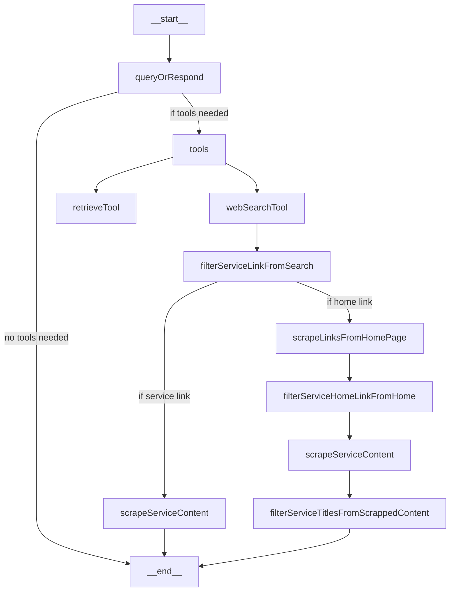
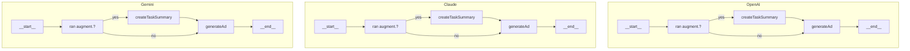

## Ai_copywriter_app

Agentic-RAG application based on 3 models generating ads for for media channels based on knowledge base context and web-search results.

## 🚀 Features

- Multi-model ad generation (OpenAI, Gemini, Claude)
- Retrieval-Augmented Generation (RAG) using a knowledge base
- Model selection: run all models or just one
- Web search with content scraping capability for concrete company and its services
- Adjustable AI settings (temperature, top-p)
- Chat history and session management
- Download chat sessions (JSON, CSV, PDF)
- Rate limiting with Upstash
- Logging and tracing with Langsmith

---

## 📊 Architecture

copywriter_ai/
├── .gitignore
├── README.md
├── next.config.js
├── package.json
├── tailwind.config.ts
├── tsconfig.json
├── /public
├── /src
│   ├── /components
│   │   ├── ChatArea.tsx
│   │   ├── ChatMessage.tsx
│   │   ├── InputField.tsx
│   │   ├── Sidebar.tsx
│   │   ├── ui/
│   │   │   ├── button.tsx
│   │   │   ├── .......
│   ├── /enums
│   │   ├── customFunction.enum.ts
│   │   ├── .......
│   ├── /fonts
│   ├── /models
│   │   ├── chatSession.model.ts
│   │   ├── .......
│   ├── /pages
│   │   ├── api
│   │   │   ├── chat.ts
│   │   ├── _app.tsx
│   │   ├── 404.tsx
│   │   ├── index.tsx
│   │   ├── settings.tsx
│   ├── /services
│   │   ├── graph
│   │   │   ├── graph.ts
│   │   │   ├── graphTools.ts
│   │   ├── knowledgeBase.ts
│   │   ├── chatApiRequest.ts
│   │   ├── rateLimitCheck.ts
│   ├── /store
│   │   ├── chatStore.ts
│   │   ├── settingsStore.ts
│   ├── /styles
│   │   ├── globals.css
│   ├── /system_prompts
│   │   ├── system_prompts.ts
│   ├── /utils
│   │   ├── knowledgeBaseUtils.ts
│   │   └── utils.ts

```

- **components/**: React UI components (chat, sidebar, buttons, etc.)
- **models/**: TypeScript models for chat sessions, messages, documents
- **pages/**: Next.js pages (entry points)
- **services/**: Business logic, graphs, tools, knowledge base integration
- **store/**: State management (e.g., Zustand)
- **styles/**: Tailwind/global CSS
- **system_prompts/**: System prompt templates
- **utils/**: Utility/helper functions

---

## 💻 Getting Started

### Prerequisites

- Node.js 22.x or later
- API keys for OpenAI, Anthropic, Google AI, Upstash Redis, Langsmith

1. Clone the repository:

   ```bash
   git clone https://github.com/TomasVask/ai_copywriter_2
   cd interview-prep-app
   ```

2. **Install dependencies:**

   ```bash
   npm install
   ```

3. **Configure environment variables:**

   Create a `.env.local` file in the root directory and add your API keys:

   ```env
   OPENAI_API_KEY=your_openai_key
   ANTHROPIC_API_KEY=your_anthropic_key
   GOOGLE_AI_API_KEY=your_google_key
   UPSTASH_REDIS_REST_URL=<url>
   UPSTASH_REDIS_REST_TOKEN=your_upstash_key
   LANGSMITH_TRACING=true
   LANGSMITH_ENDPOINT="https://api.smith.langchain.com"
   LANGSMITH_PROJECT=your_project_name
   LANGSMITH_API_KEY=your_langsmith_key
   ```
4. **Start the development server:**

   ```bash
   npm run dev
   ```

5. Open [http://localhost:3000](http://localhost:3000) in your browser.

---

# 🔧 Configuration

## 🎛 AI Settings

- **Temperature**: Controls randomness (`0.0–1.0`)
- **Top P**: Controls diversity (`0.0–1.0`)

---

# Logical graph's flow

## Augmentation Graph
   QueryOrRespond decides whether augmentation is needed, if not, graph end and then Creation Graph takes over.
   If augmentation is needed, it calls KB retrieval tool and web-search tool. 
   Web-search tool has its own flow where idea is to scrape content from single link. Priority is url link of concrete service of company, if not, then it scrapes list of services titles and returns a list.



## Creation Graph
   Once augmentation is finished, or not performed at all, creation graphs take over. 
   One graph is run per each active model. If augmentation was performed, then graph run taskSummary function to create a task for itself with combined user prompt and all contextual information. Then it runs ad generation.
   Ad generation also covers any other random response should user prompt be random.



---

# 📝 Usage

1. Describe what ad you would like create (the media channel, which company, tone of voice, etc).
2. The AI models retrieve data from knowledge base, will perform websearch and scraping of service-related info, based on this info will formulate task summary and will create ad.
3. Follow up to reiterate fro better results
6. Toggle between models work with all 3 simultaneously or pick just one.
6. Change settings for your chat experience

---

# 👩‍💻 Further Development

## 🔌 Adding New Features

- **Save history to separate DB**
- **Add CANVAS feature to each chat window**: to select wanted piece of text and follow up on that text.
- **Enhance knowledge base with Facebook ads from Facebook DB**
- **Add user authentication**
- **Improve structuring of responses**
- **Improve tone matching function**
- **Add human in the loop for saving good ads to knowledge base**

---

# 📚 Technology Stack

- [Next.js](https://nextjs.org)
- TypeScript
- OpenAI API
- Anthropic API
- Google AI API
- Material UI
- TailwindCSS
- Zod
- Upstash - for Rate Limitting
- Langsmith - for logging

Used Lovable for design library.
---

# 📄 License

This project is licensed under the **MIT License**.